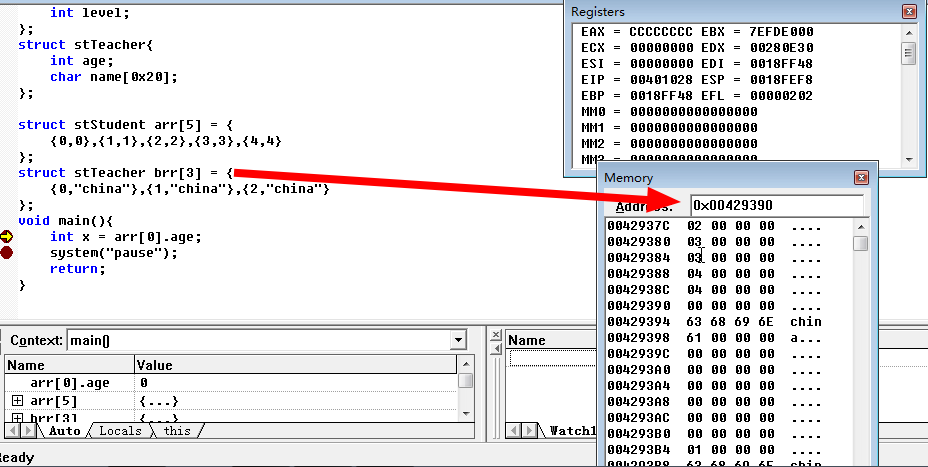
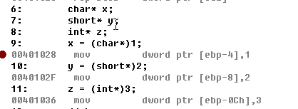
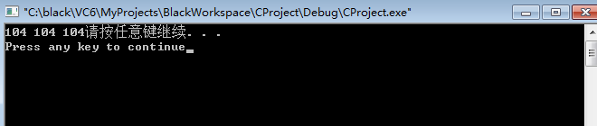
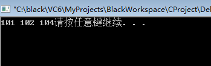
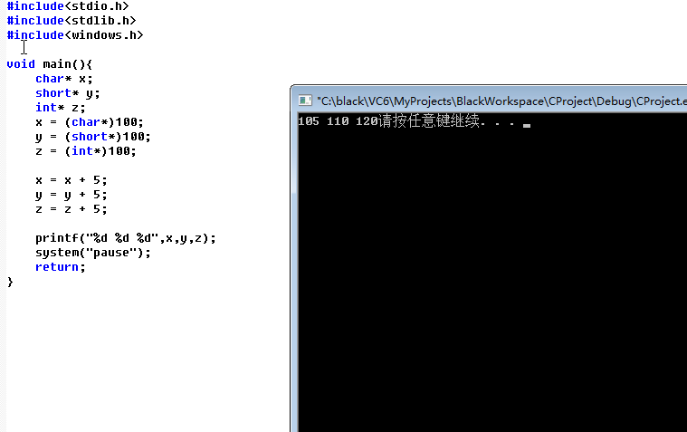
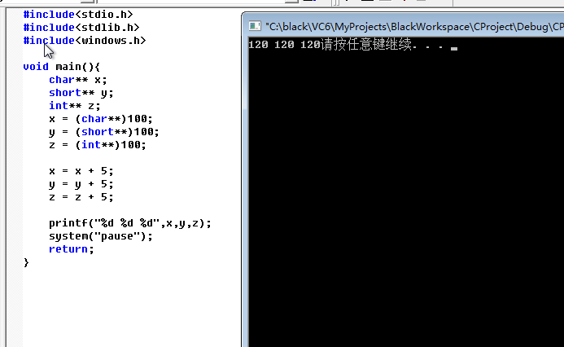

### 21.结构体数组

```c
#include<stdio.h>
#include<stdlib.h>
#include<windows.h>

struct stStudent{
	int age;
	int level;
};

struct stStudent arr[5] = {
	{0,0},{1,1},{2,2},{3,3},{4,4}
};
void main(){
	system("pause");
	return;
}
```

结构体数组在内存中是连续存放的



### 22.指针类型

指针类型的变量宽度永远是4个字节，无论类型是什么，无论有几个*；

指针其实就是一种新的类型罢了



#### 1.自增操作

```C
#include<stdio.h>
#include<stdlib.h>
#include<windows.h>

void main(){
	char**** x;
	short**** y;
	int**** z;
	x = (char****)100;
	y = (short****)100;
	z = (int****)100;

	x++;
	y++;
	z++;

	printf("%d %d %d",x,y,z);
	system("pause");
	return;
}
```



```C
#include<stdio.h>
#include<stdlib.h>
#include<windows.h>

void main(){
	char* x;
	short* y;
	int* z;
	x = (char*)100;
	y = (short*)100;
	z = (int*)100;

	x++;
	y++;
	z++;

	printf("%d %d %d",x,y,z);
	system("pause");
	return;
}
```



总结：

不带*类型的变量，++或者--都是加1或者减1，例如

int a = 0; a++;   a->1

带**类型的变量，++或者--新增（减少）的数量是去掉一个* * 之后变量的宽度：

例如：

```bash
char** a = (char**) 100;
a++;
a -> 104
//去掉一个* int** -> int* 还是一个指针变量，指针变量宽度是4字节，因此，自增4
char* a = (char*) 100;
a ++;
a -> 101
//去掉一个*  char* -> char,变成了一个char类型变量，宽度是1个字节，因此，自增1
```

#### 2.加减运算

```C
#include<stdio.h>
#include<stdlib.h>
#include<windows.h>

void main(){
	char* x;
	short* y;
	int* z;
	x = (char*)100;
	y = (short*)100;
	z = (int*)100;

	x = x + 5;
	y = y + 5;
	z = z + 5;

	printf("%d %d %d",x,y,z);
	system("pause");
	return;
}
```



char * 砍掉 * 变为 char,占用一个字节单位，所以x = x + (1 * 5) = 105

short * 砍掉 * 变为 short,占用二个字节单位，所以y = y + (2 * 5) = 110

int * 砍掉 * 变为 int,占用四个字节单位，所以z = z + (4 * 5) = 120

```C
#include<stdio.h>
#include<stdlib.h>
#include<windows.h>

void main(){
	char** x;
	short** y;
	int** z;
	x = (char**)100;
	y = (short**)100;
	z = (int**)100;

	x = x + 5;
	y = y + 5;
	z = z + 5;

	printf("%d %d %d",x,y,z);
	system("pause");
	return;
}
```



char ** 砍掉 * 变为 char * ,仍是指针变量占用四个字节单位，所以x = x + (4 * 5) = 120

short ** 砍掉 * 变为 short * ,仍是指针变量占用四个字节单位，所以y = y + (4 * 5) = 120

int ** 砍掉 * 变为 int * ,仍是指针变量占用四个字节单位，所以z = z + (4 * 5) = 120

**指针只能做加减操作，以及比较大小。**

