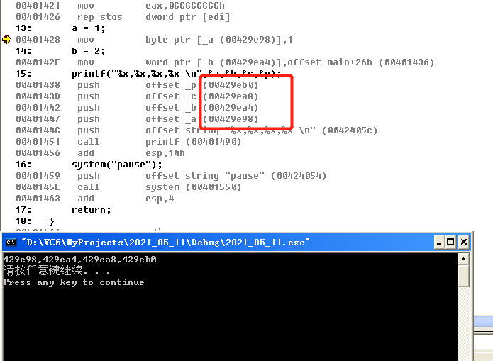
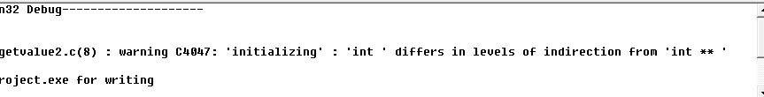

### 21.结构体数组

```c
#include<stdio.h>
#include<stdlib.h>
#include<windows.h>

struct stStudent{
	int age;
	int level;
};

struct stStudent arr[5] = {
	{0,0},{1,1},{2,2},{3,3},{4,4}
};
void main(){
	system("pause");
	return;
}
```

结构体数组在内存中是连续存放的


### 22.指针类型

指针类型的变量宽度永远是4个字节，无论类型是什么，无论有几个*；

指针其实就是一种新的类型罢了


#### 1.自增操作

```C
#include<stdio.h>
#include<stdlib.h>
#include<windows.h>

void main(){
	char**** x;
	short**** y;
	int**** z;
	x = (char****)100;
	y = (short****)100;
	z = (int****)100;

	x++;
	y++;
	z++;

	printf("%d %d %d",x,y,z);
	system("pause");
	return;
}
```


```C
#include<stdio.h>
#include<stdlib.h>
#include<windows.h>

void main(){
	char* x;
	short* y;
	int* z;
	x = (char*)100;
	y = (short*)100;
	z = (int*)100;

	x++;
	y++;
	z++;

	printf("%d %d %d",x,y,z);
	system("pause");
	return;
}
```


总结：

不带*类型的变量，++或者--都是加1或者减1，例如

int a = 0; a++;   a->1

带**类型的变量，++或者--新增（减少）的数量是去掉一个* * 之后变量的宽度：

例如：

```bash
char** a = (char**) 100;
a++;
a -> 104
//去掉一个* int** -> int* 还是一个指针变量，指针变量宽度是4字节，因此，自增4
char* a = (char*) 100;
a ++;
a -> 101
//去掉一个*  char* -> char,变成了一个char类型变量，宽度是1个字节，因此，自增1
```

#### 2.加减运算

```C
#include<stdio.h>
#include<stdlib.h>
#include<windows.h>

void main(){
	char* x;
	short* y;
	int* z;
	x = (char*)100;
	y = (short*)100;
	z = (int*)100;

	x = x + 5;
	y = y + 5;
	z = z + 5;

	printf("%d %d %d",x,y,z);
	system("pause");
	return;
}
```


char * 砍掉 * 变为 char,占用一个字节单位，所以x = x + (1 * 5) = 105

short * 砍掉 * 变为 short,占用二个字节单位，所以y = y + (2 * 5) = 110

int * 砍掉 * 变为 int,占用四个字节单位，所以z = z + (4 * 5) = 120

```C
#include<stdio.h>
#include<stdlib.h>
#include<windows.h>

void main(){
	char** x;
	short** y;
	int** z;
	x = (char**)100;
	y = (short**)100;
	z = (int**)100;

	x = x + 5;
	y = y + 5;
	z = z + 5;

	printf("%d %d %d",x,y,z);
	system("pause");
	return;
}
```


char ** 砍掉 * 变为 char * ,仍是指针变量占用四个字节单位，所以x = x + (4 * 5) = 120

short ** 砍掉 * 变为 short * ,仍是指针变量占用四个字节单位，所以y = y + (4 * 5) = 120

int ** 砍掉 * 变为 int * ,仍是指针变量占用四个字节单位，所以z = z + (4 * 5) = 120

**指针只能做加减操作，以及比较大小。**

### 23.&的使用

&是地址符，任何变量都可以使用&来获取地址，但不能用在常量上

```C
#include<stdio.h>
#include<stdlib.h>
#include<windows.h>
struct Point{
    int x;
    int y;
};
char a;
short b;
int c;
struct Point p;
void main(){
    a = 1;
    b = 2;
    printf("%x,%x,%x,%x \n",&a,&b,&c,&p);
    system("pause");
    return;
}
```



全局变量的地址在运行前就已经给好了

```bash
10:       char a;
11:       short b;
12:       int c;
13:       struct Point p;
14:       printf("%x,%x,%x,%x \n",&a,&b,&c,&p);
00401428   lea         eax,[ebp-14h]
0040142B   push        eax
0040142C   lea         ecx,[ebp-0Ch]
0040142F   push        ecx
00401430   lea         edx,[ebp-8]
00401433   push        edx
00401434   lea         eax,[ebp-4]
00401437   push        eax
00401438   push        offset string "%x,%x,%x,%x \n" (0042405c)
0040143D   call        printf (00401490)
00401442   add         esp,14h
15:       system("pause");
00401445   push        offset string "pause" (00424054)
0040144A   call        system (00401550)
0040144F   add         esp,4
16:       return;
17:   }
```

局部变量的地址在运行时才能确定


& + 一个变量，得到的结果就是 原来的变量加个*

比如：

```C
int a = 0;
int* p1 = &a; 	//原来的变量是int，加个* 变为int*

char* c;
char** p2= &c;	//同理

short*** s;
short**** p3 = &s
```

```C
#include<stdio.h>
#include<stdlib.h>
#include<windows.h>
void main(){
    char x;
    char* p1;
    char** p2;
    char*** p3;
    char**** p4;
    p1 = &x;
    p2 = &p1;
    p3 = &p2;
    p4 = &p3;
    system("pause");
    return;
}
```

=======
### 21.结构体数组

```c
#include<stdio.h>
#include<stdlib.h>
#include<windows.h>

struct stStudent{
	int age;
	int level;
};

struct stStudent arr[5] = {
	{0,0},{1,1},{2,2},{3,3},{4,4}
};
void main(){
	system("pause");
	return;
}
```

结构体数组在内存中是连续存放的


### 22.指针类型

指针类型的变量宽度永远是4个字节，无论类型是什么，无论有几个*；

指针其实就是一种新的类型罢了


#### 1.自增操作

```C
#include<stdio.h>
#include<stdlib.h>
#include<windows.h>

void main(){
	char**** x;
	short**** y;
	int**** z;
	x = (char****)100;
	y = (short****)100;
	z = (int****)100;

	x++;
	y++;
	z++;

	printf("%d %d %d",x,y,z);
	system("pause");
	return;
}
```


```C
#include<stdio.h>
#include<stdlib.h>
#include<windows.h>

void main(){
	char* x;
	short* y;
	int* z;
	x = (char*)100;
	y = (short*)100;
	z = (int*)100;

	x++;
	y++;
	z++;

	printf("%d %d %d",x,y,z);
	system("pause");
	return;
}
```


总结：

不带*类型的变量，++或者--都是加1或者减1，例如

int a = 0; a++;   a->1

带**类型的变量，++或者--新增（减少）的数量是去掉一个* * 之后变量的宽度：

例如：

```bash
char** a = (char**) 100;
a++;
a -> 104
//去掉一个* int** -> int* 还是一个指针变量，指针变量宽度是4字节，因此，自增4
char* a = (char*) 100;
a ++;
a -> 101
//去掉一个*  char* -> char,变成了一个char类型变量，宽度是1个字节，因此，自增1
```

#### 2.加减运算

```C
#include<stdio.h>
#include<stdlib.h>
#include<windows.h>

void main(){
	char* x;
	short* y;
	int* z;
	x = (char*)100;
	y = (short*)100;
	z = (int*)100;

	x = x + 5;
	y = y + 5;
	z = z + 5;

	printf("%d %d %d",x,y,z);
	system("pause");
	return;
}
```


char * 砍掉 * 变为 char,占用一个字节单位，所以x = x + (1 * 5) = 105

short * 砍掉 * 变为 short,占用二个字节单位，所以y = y + (2 * 5) = 110

int * 砍掉 * 变为 int,占用四个字节单位，所以z = z + (4 * 5) = 120

```C
#include<stdio.h>
#include<stdlib.h>
#include<windows.h>

void main(){
	char** x;
	short** y;
	int** z;
	x = (char**)100;
	y = (short**)100;
	z = (int**)100;

	x = x + 5;
	y = y + 5;
	z = z + 5;

	printf("%d %d %d",x,y,z);
	system("pause");
	return;
}
```


char ** 砍掉 * 变为 char * ,仍是指针变量占用四个字节单位，所以x = x + (4 * 5) = 120

short ** 砍掉 * 变为 short * ,仍是指针变量占用四个字节单位，所以y = y + (4 * 5) = 120

int ** 砍掉 * 变为 int * ,仍是指针变量占用四个字节单位，所以z = z + (4 * 5) = 120

**指针只能做加减操作，以及比较大小。**

### 23.&的使用

&是地址符，任何变量都可以使用&来获取地址，但不能用在常量上

```C
#include<stdio.h>
#include<stdlib.h>
#include<windows.h>
struct Point{
    int x;
    int y;
};
char a;
short b;
int c;
struct Point p;
void main(){
    a = 1;
    b = 2;
    printf("%x,%x,%x,%x \n",&a,&b,&c,&p);
    system("pause");
    return;
}
```


全局变量的地址在运行前就已经给好了

```bash
10:       char a;
11:       short b;
12:       int c;
13:       struct Point p;
14:       printf("%x,%x,%x,%x \n",&a,&b,&c,&p);
00401428   lea         eax,[ebp-14h]
0040142B   push        eax
0040142C   lea         ecx,[ebp-0Ch]
0040142F   push        ecx
00401430   lea         edx,[ebp-8]
00401433   push        edx
00401434   lea         eax,[ebp-4]
00401437   push        eax
00401438   push        offset string "%x,%x,%x,%x \n" (0042405c)
0040143D   call        printf (00401490)
00401442   add         esp,14h
15:       system("pause");
00401445   push        offset string "pause" (00424054)
0040144A   call        system (00401550)
0040144F   add         esp,4
16:       return;
17:   }
```

局部变量的地址在运行时才能确定


& + 一个变量，得到的结果就是 原来的变量加个*

比如：

```C
int a = 0;
int* p1 = &a; 	//原来的变量是int，加个* 变为int*

char* c;
char** p2= &c;	//同理

short*** s;
short**** p3 = &s
```

```C
#include<stdio.h>
#include<stdlib.h>
#include<windows.h>
void main(){
    char x;
    char* p1;
    char** p2;
    char*** p3;
    char**** p4;
    p1 = &x;
    p2 = &p1;
    p3 = &p2;
    p4 = &p3;
    system("pause");
    return;
}
```

### 23.取值运算符

首先看一段代码

```C
#include<stdio.h>
#include<windows.h>
void main(){
	int* a = (int*) 1;
	printf("%x \n",*a);

	system("pause");
	return;
}
```

其汇编代码

```bash
4:        int* a = (int*) 1;
00401028   mov         dword ptr [ebp-4],1	//[ebp-4]是第一个局部变量的位置，1放到a这个局部变量里
5:        printf("%x \n",*a);
0040102F   mov         eax,dword ptr [ebp-4]//将局部变量a的值放到eax中
00401032   mov         ecx,dword ptr [eax]	//以eax中存储的值为地址，取该地址中的值，放到ecx中
00401034   push        ecx					//将ecx入栈
00401035   push        offset string "%x \n" (00424024)
0040103A   call        printf (00401190)
0040103F   add         esp,8
6:
7:        system("pause");
00401042   push        offset string "pause" (0042401c)
00401047   call        system (00401080)
```

由上述代码可知，*取得是某一地址中存储的值

编译器会如何看待  “ *指针类型 ” 的类型呢？

```C
#include<stdio.h>
#include<windows.h>
int*** a;
int**** b;
int***** c;
int* d;
void main(){
    int x = *(a);
    system("pause");
    return;
}
```

编译：



可以看到，编译器对于 *(a)的结果，认为是一个int** 的类型。

同理，*(b)的结果是一个 int * * * 的类型

而*(d)就是一个int类型了。

总结：

*号 + 指针类型变量 = 指针类型  -  一个 *

看另一段代码

```bash
3:        int x = 1;
00401028   mov         dword ptr [ebp-4],1	//1存入局部变量 [ebp-4]的位置
4:        int*p = &x;
0040102F   lea         eax,[ebp-4]		//lea指令：取有效地址。所以这个是将[ebp-4]这个地址放到eax中
00401032   mov         dword ptr [ebp-8],eax //将eax中存储的ebp-4的地址，存储到局部变量[ebp-8]的位置
5:        printf("%x %x\n",p,*(p));
# *(p)的操作
00401035   mov         ecx,dword ptr [ebp-8]	//取[ebp-8]处存的地址，放到ecx中
0401038   mov         edx,dword ptr [ecx]		//访问ecx中存储的地址，将该地址中存储的值放入edx
0040103A   push        edx	//edx入栈
# 取p的操作
0040103B   mov         eax,dword ptr [ebp-8]	//取[ebp-8]处存的地址，放到eax中
0040103E   push        eax		//eax入栈
0040103F   push        offset string "%x %x\n" (00424024)
00401044   call        printf (00401190)
```


还有一段代码

```C
#include<stdio.h>
#include<windows.h>
void main(){
    int x = 1;
    int* p = &x;
    int** p2 = &p;
    int*** p3 = &p2;
    int r = *(*(*(p3)));
    printf("%d \n",r);
	system("pause");
    return;
}
```

```bash
4:        int x = 1;
00401028   mov         dword ptr [ebp-4],1	//1放到局部变量[ebp-4]
5:        int* p = &x;
0040102F   lea         eax,[ebp-4]	//局部变量[ebp-4]地址放到eax
00401032   mov         dword ptr [ebp-8],eax //eax放到[ebp-8]
6:        int** p2 = &p;
00401035   lea         ecx,[ebp-8]	//[ebp-8]地址放到ecx里
00401038   mov         dword ptr [ebp-0Ch],ecx //ecx放到[ebp-0Ch]
7:        int*** p3 = &p2;
0040103B   lea         edx,[ebp-0Ch] //[ebp-0Ch]放到edx里
0040103E   mov         dword ptr [ebp-10h],edx	//edx的值放到[ebp-10h]
8:        int r = *(*(*(p3)));
00401041   mov         eax,dword ptr [ebp-10h]	//[ebp-10h]中的值放到eax
00401044   mov         ecx,dword ptr [eax]
00401046   mov         edx,dword ptr [ecx]
00401048   mov         eax,dword ptr [edx]
0040104A   mov         dword ptr [ebp-14h],eax
9:        printf("%d \n",r);
0040104D   mov         ecx,dword ptr [ebp-14h]
00401050   push        ecx
00401051   push        offset string "%d \n" (00422fa4)
00401056   call        printf (00401090)
0040105B   add         esp,8
10:       system("pause");

```


